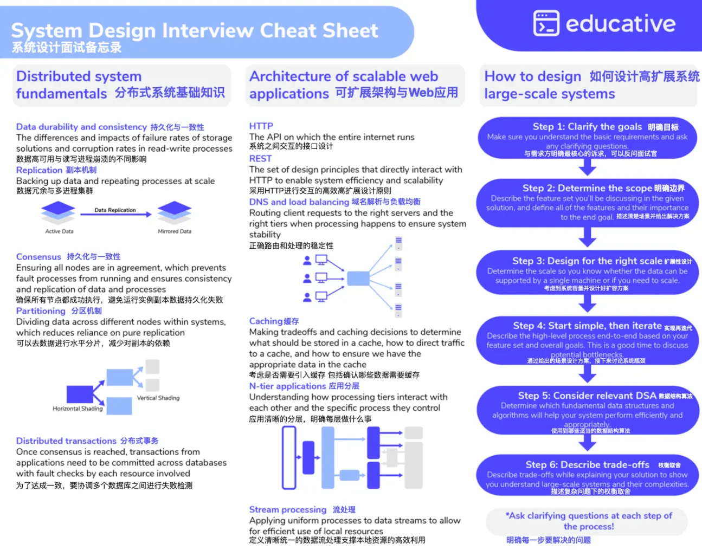

+++
title = "系统设计面试指南（EN）"
date = "2023-11-09T16:36:29+08:00"
author = ""
authorTwitter = "" #do not include @
cover = ""
tags = ["后端", "系统设计"]
keywords = ["", ""]
description = "多问澄清问题。确保自己搞清楚了场景。"
showFullContent = false
readingTime = false
hideComments = false
color = "" #color from the theme settings
+++

## How to design large-scale systems

Step 1：Clarify the goals

Make sure you understand the basic requirements and ask any clarifying questions.

Step 2：Determine the scope

Describe the feature set you'll be discussing in the given solution, and define all of the features and their importance to the end goal.

Step 3：Design for the right scale

Determine the scale so you know whether the data can be supported by a single machine or if you need to scale.

Step 4:Start simple,then iterate

Describe the high-level process end-to-end based on your feature set and overall goals.This is a good time to discuss

Step 5：Consider relevant DSA

Determine which fundamental data structures and algorithms will help your system perform efficiently and appropriately.

Step 6:Describe trade-offs

Describe trade-offs while explaining your solution to show you understand large-scale systems and their complexities.

*Ask clarifying questions at each step of the process!

## Distributed system fundamentals

Data durability and consistency 持久化与一致性

The differences and impacts of failure rates of storage solutions and corruption rates in read-write processes 读写过程中故障的概率与影响。

Replication 主备

Backing up data and repeating processes at scale 数据冗余与多进程集群

Consensus 持久化与一致性

Ensuring all nodes are in agreement,which prevents fault processes from running and ensures consistency and replication of data and processes

确保所有节点都成功执行，避免运行实例副本数据持久化失败

Partitioning 分区机制

Dividing data across different nodes within systems, which reduces reliance on pure replication （Vertical Shading & Horizontal Shading）

可以去数据进行水平分片，减少对副本的依赖

Distributed transactions 分布式事务

Once consensus is reached, transactions from applications need to be committed across databases with fault checks by each resource involved

为了达成一致，要协调多个数据库之间进行失败检测

Caching缓存

Making tradeoffs and caching decisions to determine what should be stored in a cache, how to direct traffic to a cache,and how to ensure we have the appropriate data in the cache

考虑是否需要引入缓存 包括确认哪些数据需要缓存

